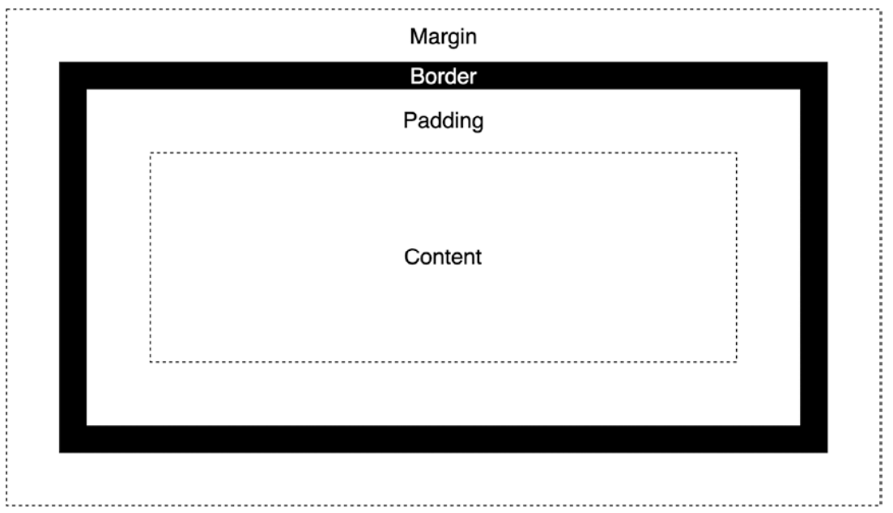

> 以下内容全部来自 《Modern CSS Master the Key Concepts of CSS for Modern Web Development》

## `box-sizing`

### `content-box`

将 `content` 作为 `width` 和 `height` 设置的边界条件

### `border-box`

将 `border` 作为 `width` 和 `height` 设置的边界条件

