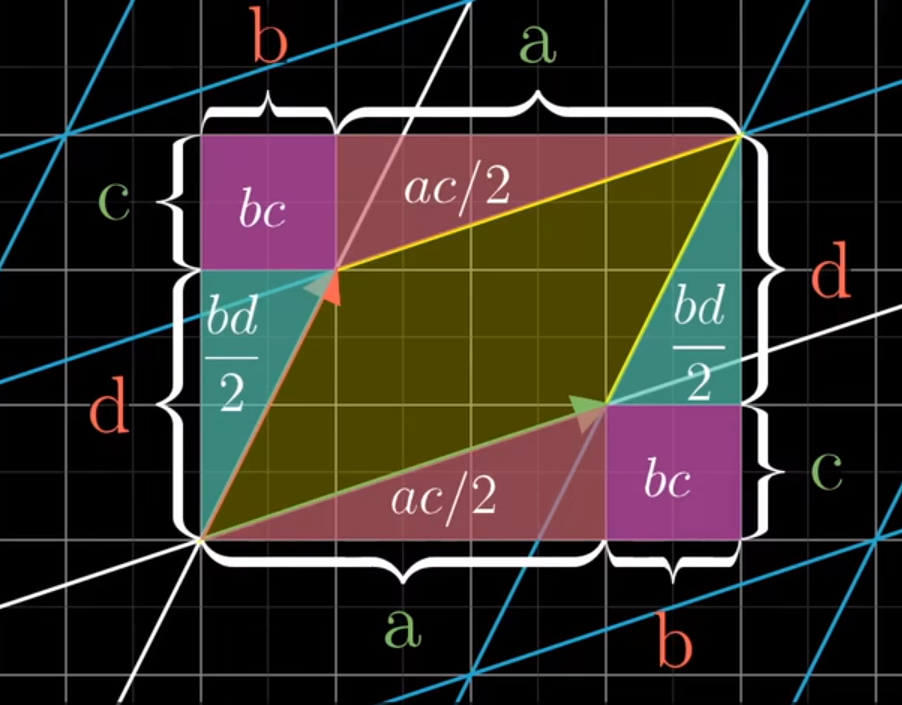

## Preface

线性代数是一个实用而方便的东西!

## 张成空间

$\vec{v}, \vec{w}$ 通过线性组合可以覆盖的空间范围

## 线性变换

~~基于只有乘法和加法运算的群~~
简单来说, 就是 保持网格线**平行**且**等距**分布 的变换

## 矩阵乘法

代表着基向量的线性变换(也可以看成目标矩阵乘单位矩阵得到一个新的线性空间)
$$
\begin{bmatrix}
1&0\\
0&1
\end{bmatrix}
\Rightarrow
\begin{bmatrix}
v_x&w_x\\
v_y&w_y
\end{bmatrix}
$$

## 行列式

计算空间积缩放比例

二维证明可以参考 Matrix67 的 [经典证明：向量叉积的几何意义](http://www.matrix67.com/blog/archives/6217)
这里放出他和3b1b给出的证明图片(经典的无字证明)


行列式看似简单, 但是在后面的内容中有着很重要的作用  
~~比如, 可以用来求逆矩阵~~  


值得说明的是,
- 当行列式等于 $0$ 的时候, 几何意义是 线性变换 使得空间的面积变换比例为 $0$, 那么就说明这个矩阵把空间压到更小的维度上了
- 负值代表了这个线性空间反转了(~~所以说叉积可以用来测向量相对方向~~)

