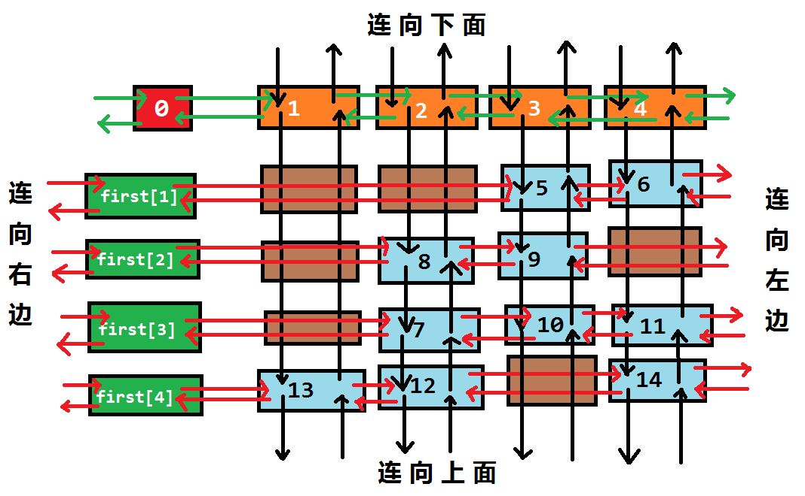

## Preface

dancing links 是一个简单而复杂的东西
- 简单: 思路很简单, 和最原始的暴力没什么区别
- 复杂: 
  - 十字指针以及写成代码后很难调试
  - 遇到题目时, 数学建模较为复杂


参考: [OI-wiki](https://oi-wiki.org/search/dlx/)


## Start up

### Definition

dancing links 是用来解决精确覆盖问题的!  
思路就是枚举每个元素, 同时删除冲突, 最终检查是否枚举了所有元素(删除冲突的操作已经保证了仅被枚举一次)  

#### X算法
前置思路(X算法)不做过多说明, 具体请参阅 [OI-wiki](https://oi-wiki.org/search/dlx/#x-%E7%AE%97%E6%B3%95)

### Implementation

X算法中要大量删除行(恢复行), 删除列(恢复列)的操作, 不好直接处理  
而且我们发现删除后, 问题规模在变小, 那么考虑 递归 求解(因为我们只需要一个解即可)
又因为是二维问题, 所以我们考虑十字指针(双向链表), 不难发现, 用下图这种存储方式是最优的!



而我们需要怎么维护这个双向链表呢?  
在X算法中, 我们考虑每次选一行, 同时处理这一行与其他行/列的冲突  

#### 前置说明

##### 相关变量的定义
```cpp
class DancingLinks{
private:
  struct node{
    int u,d,l,r;
  }nd[Max];
  int first[Max], siz[Max], col[Max];
  int cnt=0; // nd 的索引
  // record the ans
  int row[Max], stk[ansMax]; // ans stack
};
```

##### 一些解释

我喜欢使用 `u` `v` 代表元素
代码中 `c`和`r` 分别代表 `column`和`row`


#### init

看图不难得出, 我们首先得 初始化 第 0 行 的索引行(方便删除/恢复/索引)  
(最开头的0号节点也是要的, 方便之后枚举第一行的情况)  

```cpp
for(int i=0;i<=c;++i)
  nd[i]={i,i,i-1,i+1};
nd[0].l=c, nd[(cnt=c)].r=0;
```

#### dance


以下的删除指: 删掉上下/左右的十字指针链接, 达到缩小问题规模(地图)的目的


我们先来思考如何求解 
正如 X 算法中所说,   
首先应该找到(选择)一行, 并且删除与这行相关的  
具体来说就是: 找到这行所有的 "1" , 沿着这些 "1" 去删除有关的列和行  
解释: 其实就是选定了这一行后去删除冲突(**仔细思考一下**)  
完成这一步后, 问题规模就缩小了  

当然, 仔细思考过后我们发现其实只需要选定一列, 然后删除与这一列有关的元素即可  
因为我们选定的那行本身也要被删除(方便下面的运算), 至于枚举操作, 则直接放在列元素的枚举中处理即可  


此处优先选择元素最少的列进行处理, 使搜索分支尽量减少!



看不懂代码的话请看 [前置说明](#前置说明)


```cpp
int u=nd[0].l, v, c=u;
if(!u){ // 找到答案
  for(int i=1;i<dep;++i)
    ans[(stk[i]-1)/81][(stk[i]-1)/9%9]=(stk[i]-1)%9+1;
  for(int i=0;i<9;++i, cout.put('\n'))
    for(int j=0;j<9;++j)
      cout<<ans[i][j]<<" ";
  exit(0);
}
while(u){ // 可以用堆维护
  if(siz[c]>siz[u]) c=u;
  u=nd[u].l;
} // 启发? 当前列 冲突较少

// 枚举当且列下可行的行
// 先将当前列删除, 以递归求解
remove(c);
for(u=nd[c].d;u!=c;u=nd[u].d){
  stk[dep]=row[u]; // record ans
  for(v=nd[u].l;v!=u;v=nd[v].l) remove(col[v]); // 删除选中行与其他行的冲突
  solve(dep+1); // 递归求解子问题
  for(v=nd[u].l;v!=u;v=nd[v].l) recover(col[v]); // 恢复
}
recover(c);
```

由此可以引申出 `remove` 和 `recover` 函数

#### remove

根据上文定义, remove 的功能是删除有关冲突的列和行  
具体操作是删除 列索引 以及列下面冲突行("1")的上下索引(将上下的十字指针断开, 左右则无需理会, 因为删除列索引和其他所有冲突后, 左右索引不会引发新的冲突, 而且还方便恢复状态)  


`siz`是为了方便子问题中最少元素列的枚举



看不懂代码的话请看 [前置说明](#前置说明)


```cpp
nd[nd[c].l].r=nd[c].r, nd[nd[c].r].l=nd[c].l; // 暂时移除
for(int u=nd[c].d;u!=c;u=nd[u].d) // 枚举行
for(int v=nd[u].l;v!=u;v=nd[v].l) // 枚举列
  nd[nd[v].d].u=nd[v].u, nd[nd[v].u].d=nd[v].d, --siz[col[v]];
```

#### recover

这个原理其实和 `remove` 是一样的, 就是恢复刚刚删除的东西罢了  


看不懂代码的话请看 [前置说明](#前置说明)


```cpp
nd[nd[c].l].r=nd[nd[c].r].l=c;
for(int u=nd[c].d;u!=c;u=nd[u].d) // 枚举行
for(int v=nd[u].l;v!=u;v=nd[v].l) // 枚举列
  nd[nd[v].d].u=nd[nd[v].u].d=v, ++siz[col[v]];
```

#### insert

最后我们来看看插入操作  



这里要仔细思考

首先, 要说明的是, 我们的插入操作是为 `dance` 而服务的, 直白点则是为 `remove`/`recover` 服务的, 那我们其实可以摒弃平时写指针(链表)时的思想, 特殊化地写这里的十字指针即可  

首先, 我们观察到, 左右索引其实只是用来枚举行中的 "1", 那么我们其实没必要保留完整的左右信息, 当然上下信息也是一样, 所以我们插入就简单了, 直接往第一个位置插即可, 复杂度直接从 O(n) 往下降


感觉有点抽象, 仔细想想  
我的思路是直接插为第一个元素(列索引不算一个元素), 而 OI-wiki 是插第一个元素后面  
我的思路新奇但是有局限性, 建议使用 OI-wiki 的语法, 他的实现考虑得更周到一些  
(仔细思考可以发现用我这种处理方法, 行尾元素的 右索引 并不会指向头元素, 所以我的代码都是用的左索引, ~~相当于是十分有缺陷了...~~)


~~具体如何插入, 写过链表应该都不会太生疏吧~~


看不懂代码的话请看 [前置说明](#前置说明)


##### 我的实现
```cpp
col[++cnt]=c, row[cnt]=r, ++siz[c];
nd[cnt].d=nd[c].d, nd[nd[c].d].u=cnt, nd[c].d=cnt, nd[cnt].u=c; // up and down
if(!first[r]) first[r]=nd[cnt].l=nd[cnt].r=cnt;
else{
  nd[cnt].l=nd[first[r]].l, nd[cnt].r=first[r]; // self
  nd[first[r]].l=cnt; // right
  first[r]=cnt;
}
```

##### OI-wiki 实现
```cpp
col[++cnt]=c, row[cnt]=r, ++siz[c];
nd[cnt].d=nd[c].d, nd[nd[c].d].u=cnt, nd[c].d=cnt, nd[cnt].u=c; // up and down
if(!first[r]) first[r]=nd[cnt].l=nd[cnt].r=cnt;
else{
  nd[cnt].r=nd[first[r]].r, nd[nd[first[r]].r].l=cnt;
  nd[cnt].l=first[r], nd[first[r]].r=cnt;
}
```
##### diff
```diff
col[++cnt]=c, row[cnt]=r, ++siz[c];
nd[cnt].d=nd[c].d, nd[nd[c].d].u=cnt, nd[c].d=cnt, nd[cnt].u=c; // up and down
if(!first[r]) first[r]=nd[cnt].l=nd[cnt].r=cnt;
else{
-  nd[cnt].l=nd[first[r]].l, nd[cnt].r=first[r]; // self
-  nd[first[r]].l=cnt; // right
-  first[r]=cnt;
+  nd[cnt].r=nd[first[r]].r, nd[nd[first[r]].r].l=cnt;
+  nd[cnt].l=first[r], nd[first[r]].r=cnt;
}
```

### 具体实现

请参考 

