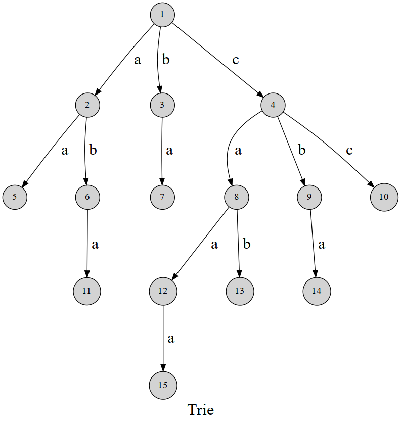

## Preface

字符串操作是 `OI` 中常见的内容

> 参考
> [字典树](https://oi-wiki.org/string/trie/)

## Trie

### 定义

像字典一样的树

### 引入


用边权来表示字符, 每个节点代表一个状态  

### 疑问

如何存储?
~~当然是 `trie[26][26][26]...`~~  

实际上会有很多节点空掉, 如果直接那样开会爆炸而且深度有限制!

所以我们~~动态开点~~吧  
设定一个 `tot` 来记录总节点, 插入节点时~~动态开点~~

`trie[Max][26], tot`

判定结束?  
- 用 `exist[Max]` 来记录当前节点是否为结尾节点

### 实现

```cpp
constexpr int Max=100000;
struct Trie {
  int trie[Max][26], tot;
  bool exist[Max];  // 该节点是否为结尾

  void insert(char *s, int l) {  // 插入字符串
    int p = 0;
    for (int i = 0; i < l; i++) {
      int c = s[i] - 'a';
      if (!trie[p][c]) trie[p][c] = ++tot;  // 如果没有，就添加结点
      p = trie[p][c];
    }
    exist[p] = 1;
  }

  bool find(char *s, int l) {  // 查找字符串
    int p = 0;
    for (int i = 0; i < l; i++) {
      int c = s[i] - 'a';
      if (!trie[p][c]) return 0;
      p = trie[p][c];
    }
    return exist[p];
  }
};
```

## 前缀函数

### 定义

在第 $i$ 位时, 子串 $s[0\dots i]$ 最长的相等的真前缀与真后缀的长度。
$$
\pi_i=\max_{k=0..i}\{k:s_{0..k-1}=s_{i-(k-1)..i}\}
$$

### 实现

#### 朴素

直接暴力枚举 $k$ 更新最大值 $\Rightarrow O(n^2)$

#### 优化

当计算到 $\pi_i$ 时  
设 $k=\pi_{i-1}$  

当 $s_{k+1}=s_i$ 时 $\Rightarrow s_{0..k+1}=s_{i-k..i}$  
满足定义式, 直接更新为 `k+1` 即可

~~可惜大部分情况都不会满足的~~

这里用 红色 表示 $\pi_{i-1}$ 表示的相等情况  
<!-- ff4242 6fb6ff -->
$\textcolor{red}{\blacksquare\blacksquare\blacksquare\blacksquare}\blacksquare\cdots\textcolor{red}{\blacksquare\blacksquare\blacksquare\blacksquare}\blacksquare$  
我们把前面那 $4$ 格拿出来看看  
现在我用蓝色表示与红色相等  
假设此时 $\pi_3=2$, 那么图像就是这样的  
$\textcolor{red}{\blacksquare\blacksquare}\textcolor{blue}{\blacksquare\blacksquare}\blacksquare$  
我们同时把后面的情况画出来  
$\textcolor{red}{\blacksquare\blacksquare}\textcolor{blue}{\blacksquare\blacksquare}\blacksquare\cdots\textcolor{red}{\blacksquare\blacksquare}\textcolor{blue}{\blacksquare\blacksquare}\blacksquare$  
为什么后面和前面如此相像?  
这里的关键是: 从 $\pi_{i-1}$ 转移到 $j=3$ (想不通的话, 看回去, 多看几遍)  
如此这般, 既然字符串是相等的, 那么后面也存在前 $2$ 块与后 $2$ 块相等  
那么, 这样可以发现前面第一块红色和后面最后一块蓝色是相等的(动脑想想, ~~画这个很累的~~)  

如此这般, 状态转移就出来了  
  
从 $0$ 开始枚举, 所以每次要 $-1$  
  
枚举 $k=\pi_{i-1}$ 诺不符合第一种直接相等的优质情况那就直接向前找, 即 $k=\pi_{k-1}$

