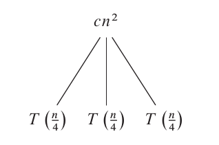
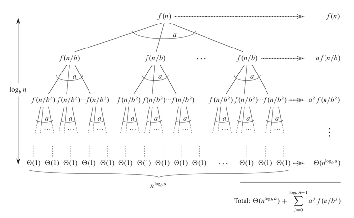

> 转载/借鉴于:
>
> 1. [从主方法到 Akra-Bazzi 定理](https://zhuanlan.zhihu.com/p/311690676)
> 2. [递归式求解——代入法、递归树与主定理](https://zhuanlan.zhihu.com/p/267890781)
> 3. [复杂度 - OI-wiki](https://oi-wiki.org/basic/complexity/#%E4%B8%BB%E5%AE%9A%E7%90%86-master-theorem)

## Start up

首先需要知道递归法求 `时间复杂度 T(n)`  
最朴素的情况是 $T(n)=aT(\frac{n}{b})+r(n);(a,b>0)$(这里使用 `r` 而非 `f` 是因为我把渐进成本理解为每层递归的余子项 )

## 前置

e.g. $T(n)=3T(\frac{n}{4})+\Theta(n^2)$

我们先来看最简单的情况:
($c$ 是常数)

这里 $cn^2$ 是当前阶段的渐进成本  
然后下面的三个 $T(\frac{n}{4})$ 则是转移成本

这里不难看出 将这颗树的所有节点的值加起来就是 $T(n)$

如此这般, 将 下面的节点也拆掉
就得到了最终图

### 树高

设当前迭代到第 $k$ 层  
每一层都是一次迭代, 我们当然是要最终迭代到 $T(1)$ 的  
那么, 在 $k$ 到最后一层时有 $\frac{n}{b^k}=1 \Rightarrow k=\log_b n$

### 叶子节点数量

每次迭代, 转移的数量都是 $a$  
也就是说 最后一层是 $a^k \Rightarrow a^{\log_b n}$  
这里我们用对数的性质可以得到: $a^{\log_b n}=n^{\log_b a}$

  
首先证明: $a^{log_a n}=n$(将指数拆为对数形式易得)

$$
\begin{split}
a^{\log_b n}&=b^{\log_b (a^{\log_b n})}\\
&=b^{\log_b n\cdot \log_b a}\\
&=b^{\log_b a\cdot \log_b n}\\
&=b^{\log_b (n^{\log_b a})}\\
&=n^{\log_b a}
\end{split}
$$



### 总成本

这个比较复杂, 我们先列出公式(从递归图得来, 最后一层+其他层)

$$
\begin{split}
T(n)&=aT(\frac{n}{b})+r(n);(a,b>0)\\
&=\Theta(n^{\log_b a})+\sum_{k=0}^{log_b n-1}a^kr(\frac{n}{b^k})
\end{split}
$$

记

$$
\begin{split}
V(n)&=n^{\log_b a}\\
R(n)&=\sum_{k=0}^{log_b n-1}a^kr(\frac{n}{b^k})
\end{split}
$$

> 此时 $V(n)$ 和 $R(n)$ 的大小共同决定了 $T(n)$, 而 $V(n)$ 是确定的, 比较简单, 我们主要来研究 $R(n)$

  
注意: 以下 $\log_b a-\epsilon=\log_b (a)-\epsilon$


分类讨论:

$$
T(n) = \begin{cases}
\Theta(n^{\log_b a}) & r(n) = O(n^{\log_b a-\epsilon}),\epsilon \geq 0\\
\Theta(r(n)) & r(n) = \Omega(n^{\log_b a+\epsilon}),\epsilon\ge 0,\ 0<c<1,\ n>N,\ a r(\frac{n}{b}) \leq c r(n)\\
\Theta(n^{\log_b a}\log^{p+1} n) & r(n)=\Theta(n^{\log_b a}\log^p n),k\ge 0
\end{cases}
$$

#### 性质一

$r(n) = O(n^{\log_b a-\epsilon}),\epsilon > 0$



以下在非关键部分省略 $\sum$ 的参数

$$
\begin{split}
R(n)&=\sum a^kr(\frac{n}{b^k})\\
&\le \sum a^k\cdot (\frac{n}{b^k})^{\log_b a-\epsilon}\\
&=n^{\log_b a-\epsilon}\cdot \sum (\frac{a}{b^{\log_b a-\epsilon}})^k\\
&=n^{\log_b a-\epsilon}\cdot \sum (\frac{ab^\epsilon}{b^{\log_b a}})^k\\
&=n^{\log_b a-\epsilon}\cdot \sum_{k=0}^{\log_b n-1} b^{k\epsilon}\\
&=n^{\log_b a-\epsilon}\cdot \frac{n^\epsilon-1}{b^\epsilon-1}\\
&=n^{\log_b a}\cdot \frac{1-\frac{1}{n^\epsilon}}{b^\epsilon-1}\\
R(n)&=O(n^{\log_b a})
\end{split}
$$



#### 性质三

$r(n)=\Theta(n^{\log_b a}\log^p n),k\ge 0$



其实第三种情况和第一种是完全共通的  
和性质一证明方法相同带入计算化简, 最终可以得到 $R(n) = n^{\log_b a}\log^k n\log_b n-\Delta$, $\Delta$ 为负数, 我们直接忽略, 然后换底公式, 将换出来的底当作系数, 再乘即可得到最终结果  



#### 性质二

$r(n) = \Omega(n^{\log_b a+\epsilon}),\epsilon\ge 0,\ 0<c<1,\ n>N,\ a r(\frac{n}{b}) \leq c r(n)$



首先 $R(n) = \Omega(r(n))$，又因为 $a r(\dfrac{n}{b}) \leq c r(n)$，只要 $c$ 的取值是一个足够小的正数，且 $n$ 的取值足够大，因此可以推导出：$R(n) = O(r(n)$)。两侧夹逼可以得出，$R(n) = \Theta(r(n))$。  

首先, $R(n)=\sum_{k=0}^{\log_b n-1} a^kr(\frac{n}{b^k})=r(n)+\sum_{k=1}^{\log_b n-1} a^kr(\frac{n}{b^k})=\Omega(r(n))$

然后, 每层转移都满足 $a r(\frac{n}{b}) \leq c r(n)$  
即 $a^k r(\frac{n}{b^k}) \leq c^k r(n)$  
放缩, 合并, 等比数列求和, 有  
$$
\begin{split}
R(n)&\le r(n)\cdot \sum_{k=0}^{\log_b n-1} c^k\\
&\le r(n)\cdot \sum_{k=0}^{+\infty} c^k\\
&=r(n)\cdot \frac{1-c^{+\infty}}{1-c}\\
&=r(n)\cdot \frac{1}{1-c}\\
R(n)&=O(r(n))
\end{split}
$$  
夹逼定理可得到 $R(n)=\Theta(r(n))$



## 应用

很多时候三个情况都可以使用, 具体问题具体分析了

### 例1

$T(n)=T(\frac{n}{2})+1$



这里 $\log_b a=0$, 可以用第三情况得出 $T(n)=n^0\log_b^1 a$  
当然也可以看作 $\epsilon=0$ 的第一情况得出



### 例2

$T(n)=T(\frac{n}{2})+n$



这里 $\log_b a=0$, 而 $r(n)=n^1\neq n^0$, 显然不能用第三种情况, 显然只能用第二种情况, 得出 $T(n)=n$



### 例3

$T(n)=\frac{5}{2}T(\frac{2}{5}n)+n\log_2^2 n$



这里 $\log_b a=1$, 显然是第三种情况, 得出 $T(n)=n\log_2^3 n$



### 例4

$T(n)=3T(\frac{n}{4})+n\log_2 n$



这里 $log_b a=\log_4 3<1$ (而且后面带了个尾巴 $\log_2 n$), 显然用第二种 显然用第二种, 得出 $T(n)=n\log_2 n$


