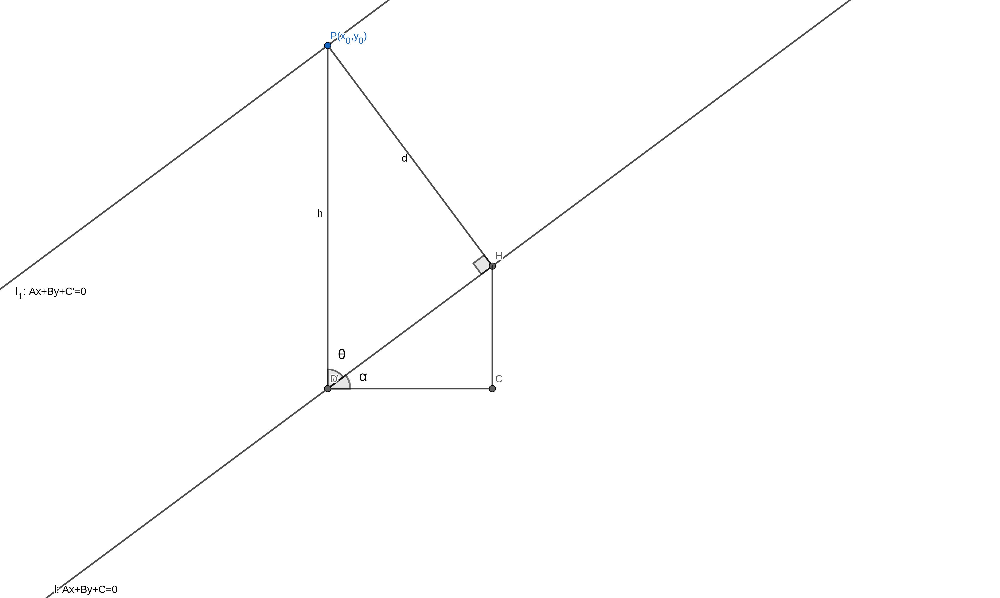

## 一般式(点法式)

$$
Ax+By+C=0
$$

由斜率可以推出 $(B,-A)$ 为其方向向量  
随即不难构造其 法向量 $(A,B)$

## 距离

### 点到直线

$$
\begin{split}
P(x_0,y_0)\\
l: Ax+By+C=0
\end{split}
$$

如图, 做如图所示的各元素

$$
\begin{split}
d&=h\cdot \sin\theta\\
&=h\cdot \cos\alpha
\end{split}
$$

又
$$
tan\alpha=k=-\frac{A}{B}
$$
有
$$
cos\alpha=\frac{B}{\sqrt{A^2+B^2}}
$$

设 $P$ 经过 $l': Ax+By+C'=0$

有(由 $y=-\frac{A}{B}x-\frac{C}{B}$ 可得)
$$
\begin{split}
h&=|-\frac{C'}{B}+\frac{C}{B}|\\
&=|\frac{Ax_0+By_0+C}{B}|
\end{split}
$$

答案呼之欲出

$$
d=\frac{|Ax_0+By_0+C|}{\sqrt{A^2+B^2}}
$$