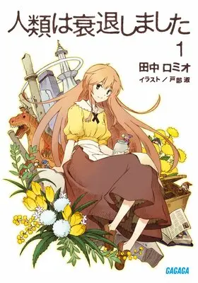
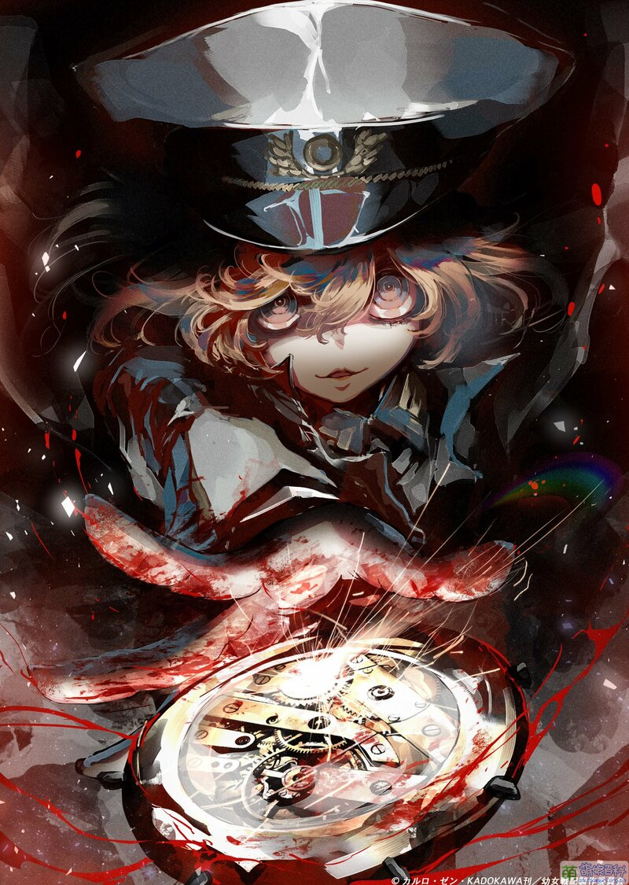
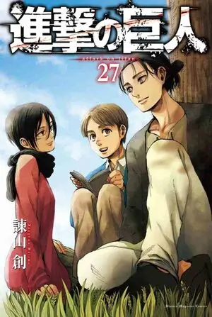

<link rel="stylesheet" href="/作品评论/s.css">
<link rel="stylesheet" href="s.css">

## Preface

在人间拾取柴火, 无意间奇遇古树, 深根足以撼人心, 繁叶足以造幽静.  
枯柴不枯, 只因古树.  

## Start up

### 86 - 不存在的战区

  
    86 - 不存在的战区
    <a href="https://zh.moegirl.org.cn/86_-不存在的战区-" target="_blank">moeWiki</a>
  
  
  对世间一切残酷的思考, 究竟如何做到被如此传神地刻画入一个如此奇迹的作品? 
  一切刻画, 皆水到渠成般自然, 眼泪也随声应下(已经不知究竟混杂了多少复杂的情愫) 
  最使人动容, 理想与现实的交融! 太多了, 多到数不过来, 然而这都是我不知道期盼了多少个日日夜夜的事情! 不知道多少次为这悲惨的无救的世界呼喊!  
  放下那极端的理想主义和现实主义, 交融吧, 理想和现实都是不可分割的! 去打碎这个世界? 去拯救这个世界? 水到渠成罢了!  
  放下那无趣的阻碍历史车轮之木, 别忘却了, 你们曾是车轮的原料, 无论如何阻碍, 都会被那一声声的呐喊打碎的! 呐喊! 呐喊! 打碎! 打碎! 
  究竟还是无法将一切情愫一并抒发出来, 暂时只能以 「这世界上没有任何国家，会因为国内饲养的猪未获得人权而受到谴责」 作结语了! 
  (Avid 与它真是绝配! 那呐喊的力量点点滴滴打在我身上, 无时无刻不在敲打着我, 提醒着我, 究竟如何才能再次整装出发?) 
  


Ref: https://zh.moegirl.org.cn/File:86_Vol1.jpg


### Charlotte

我对拯救世界无感, 但是使命感责任感则是我这个阶段的主要思想  
其中透露出的对世界的使命感和责任感, 以及特殊能力所来带的令人激动的战斗与坚守  

可惜的是, 不知道是急着结尾还是如何, 感觉最后一段夺取所有能力者的过程有点过于顺利和急促了.  
(白柳今后会怎样呢?看来完全就是为剧情服务的角色了...)

从特殊化回归到正常化, 总有点从热烈的夏天转为清净的秋天的奇妙的感觉  


一切都已结束, 归于虚无, 所有的一切将只存于深邃记忆中  
归于平静的田园, 稻香吹, 黄昏被我们守候  


我喜欢这种不娇柔造作的感觉, 喜欢奈绪这种平静的理智(尽管痛苦深埋)  

### Re: Creators


如此复杂的种种情愫, 星空一般, 绚丽而使人不知觉地回味  
让我复仇, 以世界为敌! 让我释怀, 以你为种! 生根发芽, 根植心中!


很新奇的作品, 所传达的世界观和有意思, 有种"元动漫"(简单来说就是自我指涉, 自我"思考")的感觉了  

世上从来没有正义(对错), 只有不断变化着的敌人和盟友  
**我是如此地希望 阿尔泰尔 可以毁掉那个世界**
不过 岛崎刹那 出现了, 那一刻, 大概可以放下了, 去找寻一个空旷之地吧!  
无论如何, 这绝对是最好的结局, 使我感怀的结局!    

与我想的毫无偏差, 无论真假, 所有的行动都是为了目标而服务的!  
不要在追寻目标的时候忘记它了! 那多么可悲?!   
这的确是可歌可泣的使人割裂的道理啊!  



以此做结: 希望在那个世界, 不再有其他杂碎干扰, 一心投身于乐趣, 去创造, 去实现!  
不被他人看到也无妨, 时间将证明一切, 释怀一切.  


### 人类衰退之后

  
    人类衰退之后
    <a href="https://www.bilibili.com/bangumi/play/ss703" target="_blank">bilibili</a>
  
  一部很有趣的 `黑色童话`, 讲故事的方式比较平缓, 但是就是在这种看似平缓的节奏中引入了很多对当下社会的思考与映射, 值得我们深思!

### 幼女战记

<!-- 真是讽刺, 被自己女儿送的枪杀了 -->

  
    幼女战记
    <a href="https://mzh.moegirl.org.cn/幼女战记" target="_blank">moeWiki</a>
  
  


Ref: https://mzh.moegirl.org.cn/File:Yojo_Senki_Movie_Teaser.jpg  


### 进击的巨人

  
    进击的巨人
    <a href="https://mzh.moegirl.org.cn/进击的巨人" target="_blank">moeWiki</a>
  
  大量的圆形人物刻画加上复杂又有深意的剧情，给人一种割裂感，这是自己念想的基石被打碎后的感觉，一次次左右为难，他没有给出答案，甚至逃避了一切，即便如此，这庞大世界观还是令我惊异！
改版后的结尾，我印象十分深刻，他还真是把一切都涵盖在了这个结尾啊！
感觉他根本不是讽刺, 而是无力地揭示, 但这无力实在是很有力!


Ref: https://mzh.moegirl.org.cn/File:Attack_on_Titan_final_Season_kv17.jpg  


## 成文分析计划

- [ ] 86 - 不存在的战区 (大概是目前来说最喜欢的作品吧)

- [ ] 心理测量者
- [ ] 人狼村之谜

- [ ] 进击的巨人
- [ ] 人类衰退之后
- [ ] 幼女战记

## likely

1. 86 - 不存在的战区
1. 进击的巨人
1. 心理测量者
1. 人类衰退之后
1. 来自新世界
1. 幼女战记
1. Re: Creators
1. 
